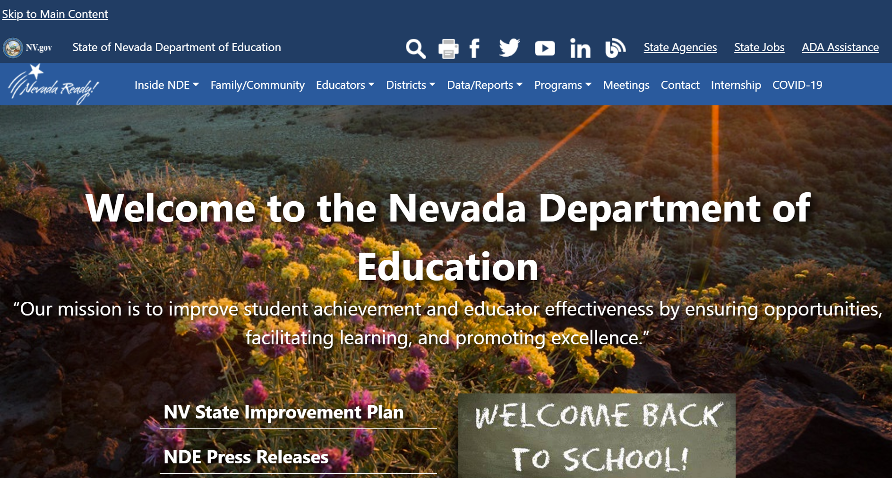
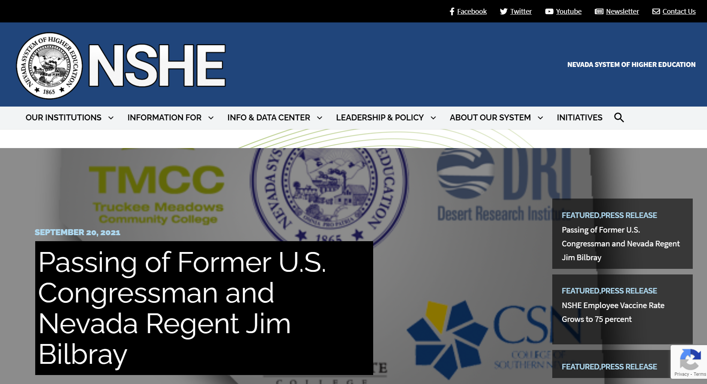

# Assignment 1: Heuristic Evaluation
## Education in Nevada
Aye Pyae | DH110 | Fall 2021
### About the project
Nevada's K-12 public education system is ranked one of the lowest nationally. 
personal link/Description about the project how you want to contribute with your UX Design

## Website 1: [Nevada Department of Education](https://doe.nv.gov/)

View the website here: [Nevada Department of Education](https://doe.nv.gov/)
### Background Information
description
### Overall evaluation
description
### Heuristic evaluation

## Website 2: [Nevada System of Higher Education](https://nshe.nevada.edu/)

View the website here: [Nevada System of Higher Education](https://nshe.nevada.edu/) 
### Background Information
description
### Overall evaluation
description
### Heuristic evaluation

