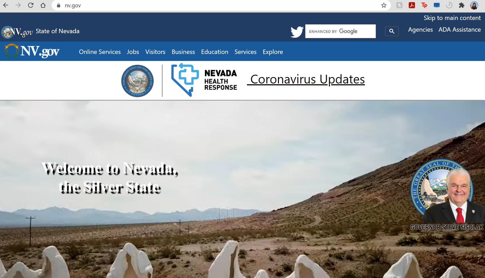

# Assignment 1: Heuristic Evaluation
## Education in Nevada
Aye Pyae | DH110 | Fall 2021
### About the project
3-5 sentences about education in Nevada.
personal link/Description about the project how you want to contribute with your UX Design

## Website 1: Department of Education
screenshot
# Background Information
description
# Overall evaluation
description
# Heuristic evaluation
https://nv.gov/agencies

