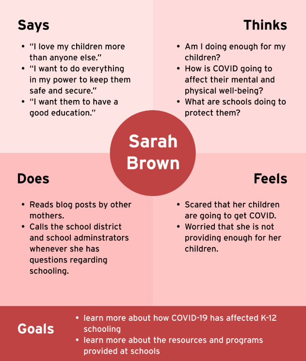
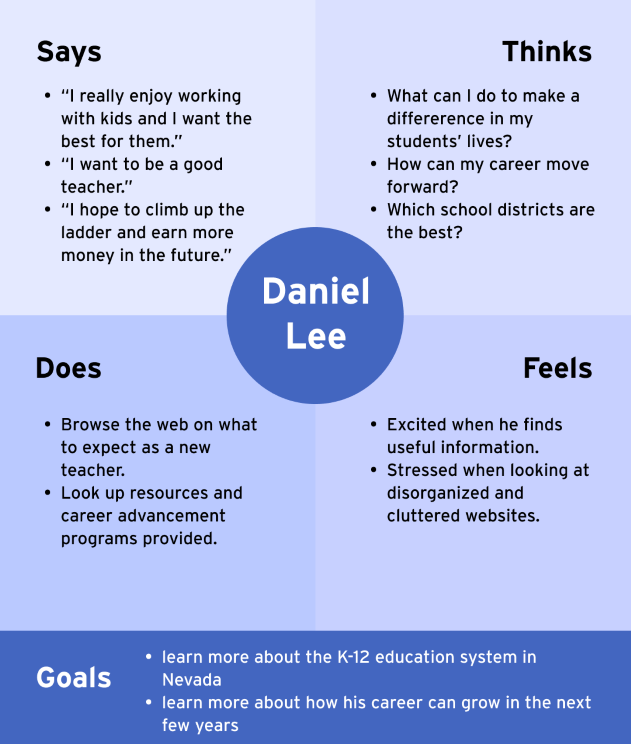

# Assignment 4: Persona + Scenario
Aye Pyae | DH110 | Fall 2021

## The Purpose of UX Storytelling
- To understand the users from their perspectives and see how they view the world.
- Recognize target users' behaviors, pain points, goals, challenges, and more.
- Create designs that focuses on users' needs through creating and analyzing personas in detail.

## Design Features
Based on my previous research, I have identified 2 features that needs to be implemented or improved upon.
- **Live chat**: A live chatbox feature will be helpful for getting answers to questions immediately - just like a phone call but digital instead.
- **Navigation bar**: A more organized navigation bar needs to be created as the current one was found to be too cluttered.

## Persona and Empathy Map
### **Persona 1: Sarah Brown - stay-at-home mom**

### **Persona 2: Daniel Lee - the dedicated teacher** 

## Scenarios and Journey Map
### 1. Sarah's Scenario and Journey Map
**Why is Sarah using this product?**  
Due to the chaos of the pandemic, school districts and school administrators cannot answer phone calls as they are not in their offices. Hence, she needs to turn to the internet to look for her answers. As her both of her children are still in elementary school, she wants to learn more about the education system beyond that. She is also curious about what schools are doing with online classes, as well as in-person classes. She has a lot of questions but finds it difficult to find the answers to her questions. Becuase she is not good with technology, she has been finding it stressful to help her children set up Zoom calls for their classrooms. She is also worried about schools reopening and the risks of COVID in the school setting.

**How is Sarah using this product?**  
Her children just started their Zoom classes in their own rooms so she has some free time to browse the internet. While sitting at her dining table, she switches on her laptop and goes onto the Nevada Department of Education website in hopes of finding answers to some questions. With only thirty minutes to spare, she does not want to take too long searching for answers.  
Once on the Nevada Department of Education website, she finds the live chat box button on the bottom right of the page. She clicks on it and a small window pops up. She has to input her contact information first, so as to ensure there are no trolls. She has the option to input her email address so that the transcript of their conversation can be saved and sent to her after it is over. After doing all of this and clicking next, she is then connected to a real person who has extensive knowledge on K-12 education (i.e. school adminstrator, staff, etc.).    
She then asks her questions. The person she is talking to answers her questions in real time. They also send Sarah links to the pages with more information. Sarah appreciates the person's helpfulness.  
Sarah's children are almost done with their classes. She clicks on the leave chat button near the top of the window. Another window pops up with a Feedback form. 
She fills out the feedback form, submits it, and turns off her laptop. She feels satisfied that her questions have been answered. 

**Sarah's Journey Map**

### 1. Daniel's Scenario and Journey Map
**Why is Daniel using this product?**  
Daniel is tech-savvy and turns to the internet for most of his questions. He wants to explore different programs that will be helpful for his teaching career. He also wants to learn more about what he can do for his students to make a difference in their lives. He wants to help them find programs and different activities they can do. As he is a young millenial, he is familiar with the web and other digital technologies. However, he gets frustrated when he comes across old interfaces that are not easy to use.

**How is Daniel using this product?**  
Daniel just finished teaching all of his classes for the day. He has quite a bit of free time before he meets his friends from college for dinner. He wants to learn more about organized navigation bar. He is pleasantly surprised to see the new and improved website. The navigation bar is much more organized and it is much easier to find the information that he needs. He likes that it is categorized accordingly and that it is intuitive to use.  
He hovers over the Educator tab and looks through the different sub-tabs. He clicks on the sub-tab called "Career Advancement". He scrolls through the page and opens up different pages that are hyperlinked on different tabs, so that he can go through them after a quick initial scan on the page.
He clicks on the Programs for students tab.

**Daniel's Journey Map**

## Reflection
Coming up with personas and trying to think in my users' perspectives, while taking into account the findings and insights from my previous research was more challenging than I expected. It was a little difficult to move away from my biases and my own lens in viewing things. However, it was very fulfilling when I completed the persons, empathy maps, and journey maps. I now understand what user-centered design means and how to take into consideration my users' needs and wants when interacting with an application.
