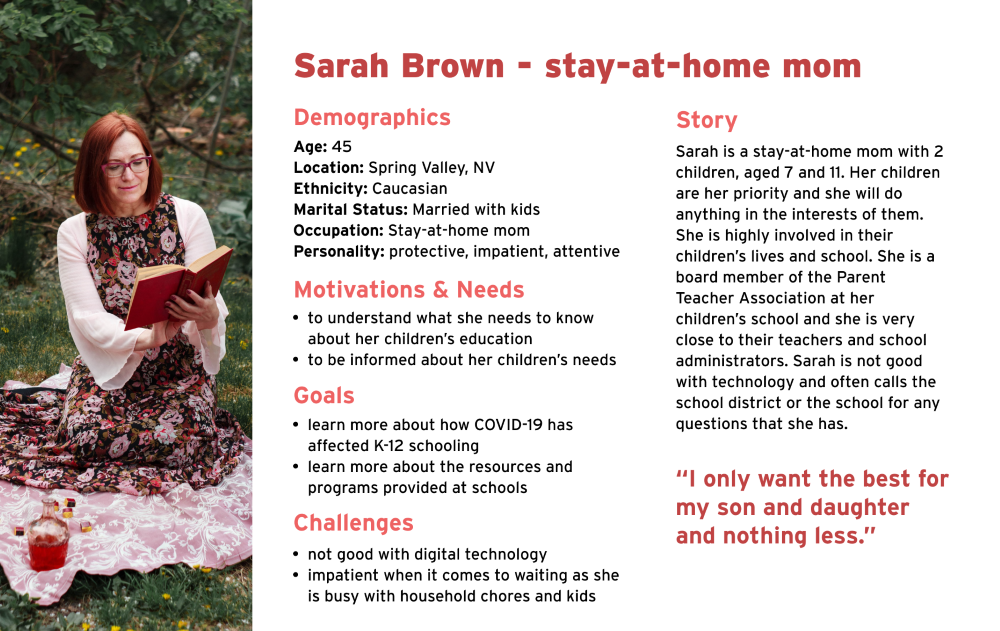

# Assignment 4: Persona + Scenario
Aye Pyae | DH110 | Fall 2021

## The Purpose of UX Storytelling
- To understand the users from their perspectives and see how they view the world.
- Recognize target users' behaviors, pain points, goals, challenges, and more.
- Create designs that focuses on users' needs through creating and analyzing personas in detail.

## Design Features
Based on my previous research, I have identified 2 features that needs to be improved upon or implemented.
- **Live chat**: A live chatbox feature will be helpful for getting answers to questions immediately - just like a phone call but digital instead.
- **Navigation bar**: A more organized navigation bar needs to be created as the current one was found to be too cluttered.

## Persona and Empathy Map
**Persona 1: Sarah Brown - stay-at-home mom**

**Persona 2: Daniel Lee - the dedicated teacher**

## Scenarios and Journey Map
### 1. Sarah's Scenario and Journey Map
**Why is Sarah using this product?**

**How is Sarah using this product?**
Live chat

**Daniel's Journey Map**

### 1. Daniel's Scenario and Journey Map
**Why is Sarah using this product?**

**How is Daniel using this product?**

**Daniel's Journey Map**

## Reflection
